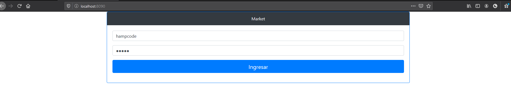
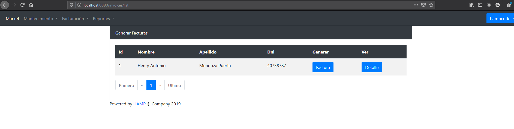
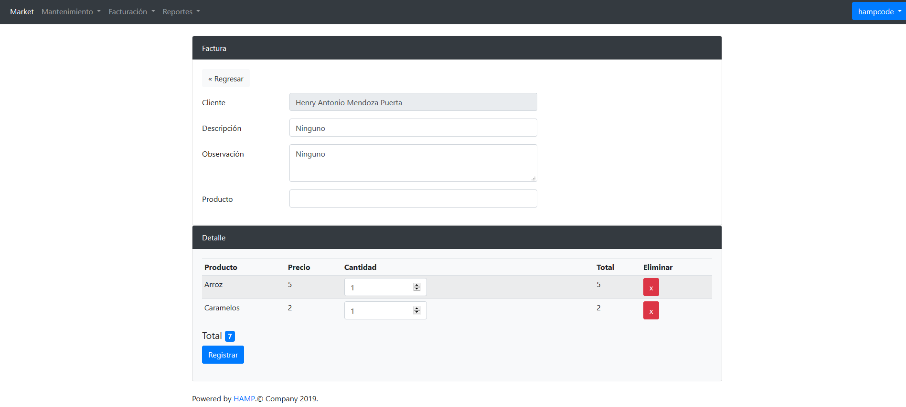
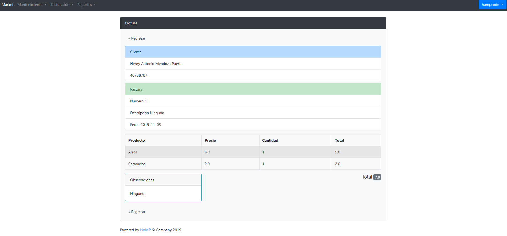
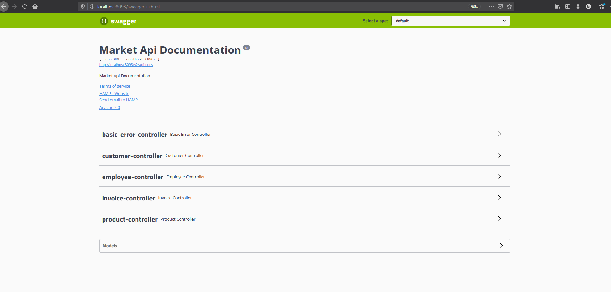
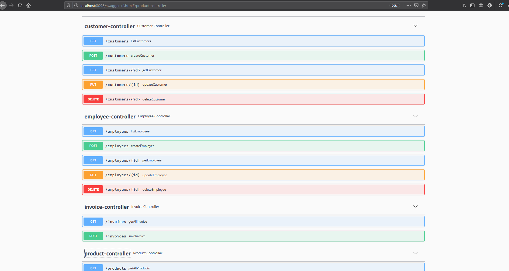
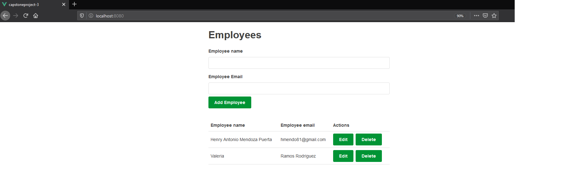

## MarketApp 🚀

Aplicación Web y API REST con Spring Boot, Spring Data JPA, PostgreSQL, Thymeleaf, Swagger y Vue

## Construido con 🛠️

Las herramientas que se han usado para construir el proyecto fueron:

* [Spring Boot]() - Spring Boot
* [Spring Data JPA]() - Spring Data JPA
* [Thymeleaf]() - Thymeleaf
* [PostgreSQL]() - PostgreSQL
* [Swagger]() - Swagger
* [Node]() - Node
* [Vue]() - Vue
* [Vue CLI]() - Vue CLI

## Autor ✒️

Por el momento yo soy el unico autor :D

* **Henry Antonio Mendoza Puerta** -  [hamp](http://www.linkedin.com/in/henrymendozapuerta)

